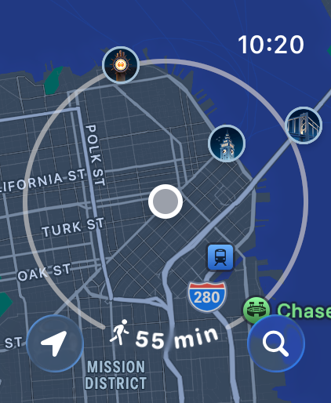
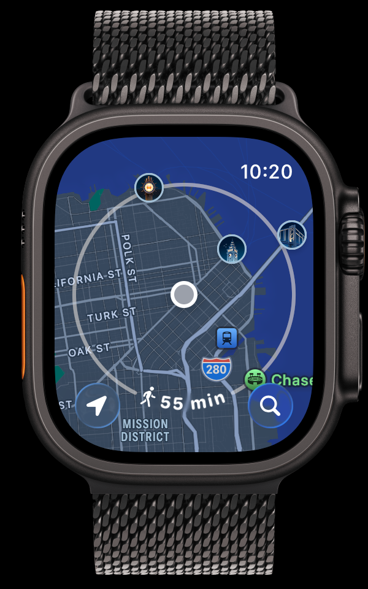

# watchframe

Wrap Apple device screen recordings and screenshots in a device frame for presentation-ready output.

## Example

| Before | After |
|--------|-------|
|  |  |

## Installation

```bash
pip install -r requirements.txt
```

## Setup

Download device frames from [Apple Design Resources](https://developer.apple.com/design/resources/#product-bezels):

1. Download the device bezels you need, such as "Apple Watch" or "iPhone 16"
2. Extract and copy the `PNG/` folder to this project's root directory

## Usage

### Frame a video

```bash
python3 watchframe.py -s examples/recording.mov -f "PNG/Milanese Loop/AW Ultra 3 - Black + Milanese Loop.png"
```

### Frame an image

```bash
python3 watchframe.py -s examples/screenshot.png -f "PNG/Milanese Loop/AW Ultra 3 - Black + Milanese Loop.png"
```

By default, mismatched screenshot/frame sizes use `--fit cover`, which fills the
device screen opening without gutters and crops from the center if the aspect
ratios differ. For a pixel-perfect result, use a bezel that matches the source
screenshot's device model and screen resolution.

```bash
python3 watchframe.py -s screenshot.png -f frame.png --fit cover
python3 watchframe.py -s screenshot.png -f frame.png --fit contain
python3 watchframe.py -s screenshot.png -f frame.png --fit stretch
```

### Custom output path

```bash
python3 watchframe.py -s input.mov -f frame.png -o output.mp4
```

### Manual screen positioning

If auto-detection doesn't find the correct screen area:

```bash
python3 watchframe.py -s recording.mov -f frame.png --screen-x 95 --screen-y 219 --screen-width 410 --screen-height 502
```

## How It Works

1. Loads the device frame PNG (must have transparent screen area)
2. Detects the screen region via connected component analysis on the alpha channel
3. Renders the source media into a screen-sized layer using the selected fit mode
4. Masks that layer to the frame's transparent screen opening
5. Alpha-composites the Apple frame on top so rounded corners and glass edges win
6. Outputs MP4 (video) or PNG (image)

## Device Frame Requirements

- PNG format with alpha channel (RGBA)
- Screen area must be transparent (alpha < 10)
- Frame should have the watch body/bezel as opaque pixels

## Supported Formats

**Images:** `.png`, `.jpg`, `.jpeg`, `.bmp`, `.tiff`, `.webp`

**Videos:** `.mov`, `.mp4`, `.avi`, `.mkv`, `.webm`, `.m4v`

## License

MIT
